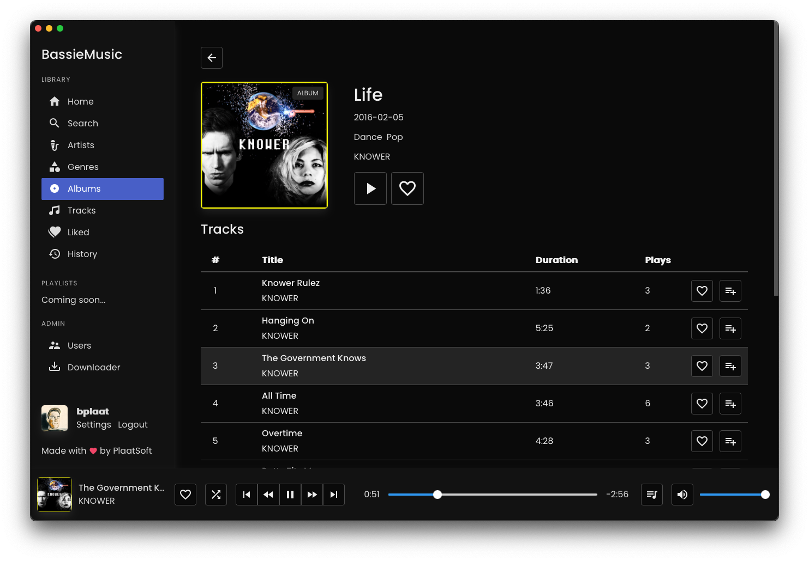
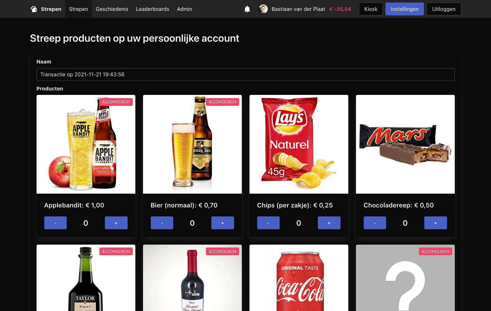

# Hey, I am Bastiaan van der Plaat
A graduated Technical Computer Science student at the Hogeschool Rotterdam, my hobby's are programming and scouting.

# Project Highlights

## BassieMusic
An online music streaming platform with download capabilities

 

## Strepen
A new modern strepen system for Scouting Die Kantanky's with a mobile application

 

## Win32asm
Windows programs completly written in x86 & x86_64 assembler

 

## PlaatCraft
A Minecraft like game written in C and modern OpenGL 3.3
