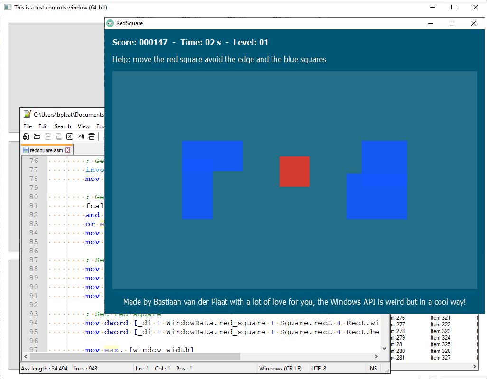
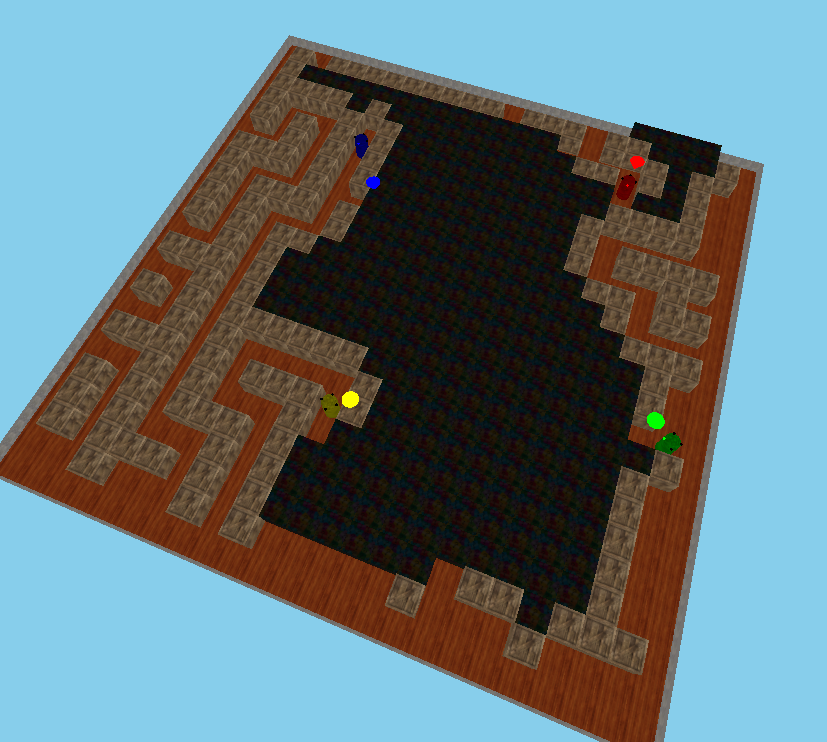
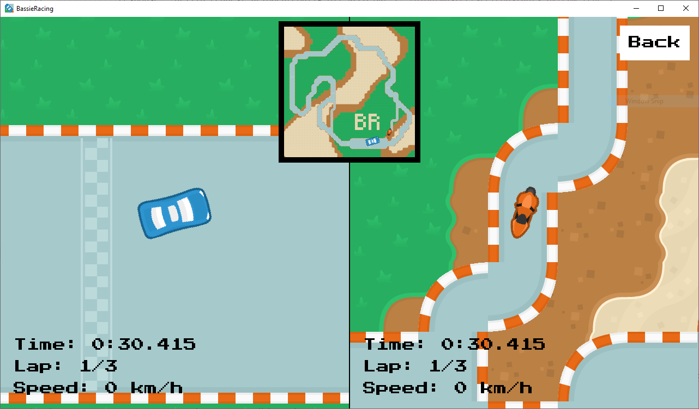
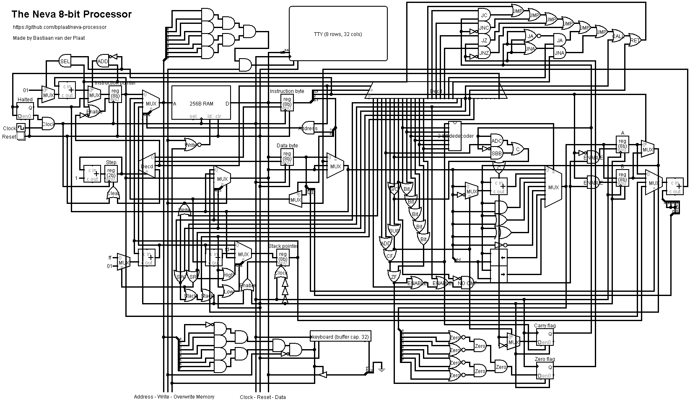
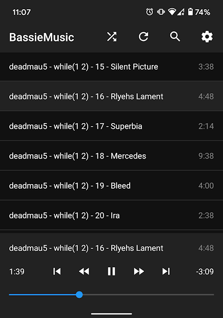
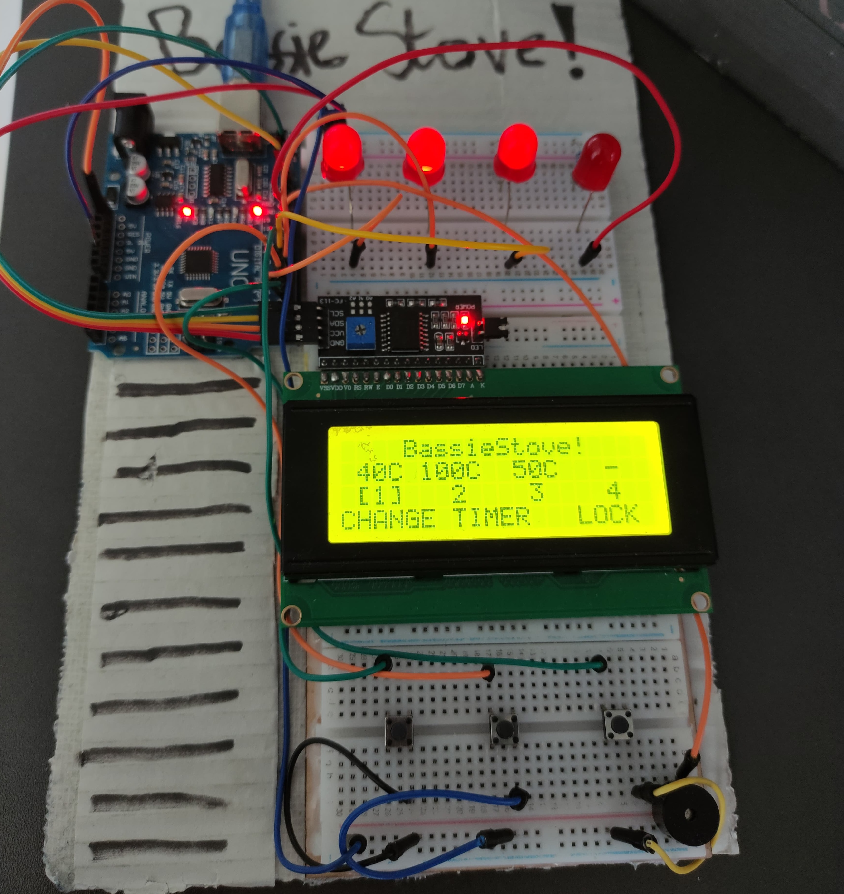
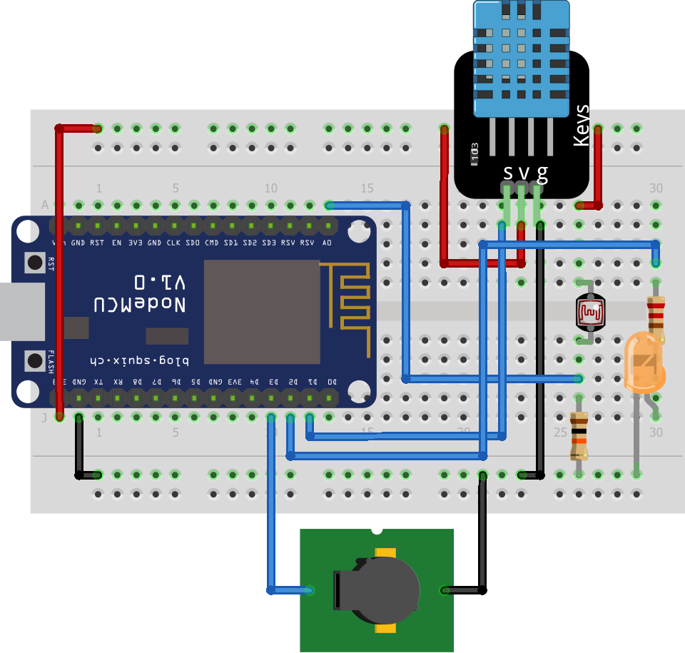
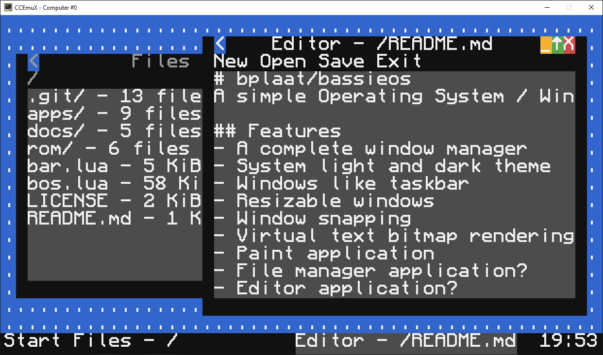

# Hey, I am Bastiaan van der Plaat
A Technical Computer Science student at the Hogeschool Rotterdam

# Project Highlights

## Win32asm
Windows programs completly written in x86 & x86_64 assembler

 

## Megabots
A robots simulation written with Python clients and Python communication server with a 3D web front-end

 

## PlaatCraft
A Minecraft like game written in C and modern OpenGL 3.3

 

## BassieRacing
A Python 2d racing game with map editor made with PyGame

 

## Neva processor
A simple 8-bit processor made with Logic gates with web simulation

 

## BassieMusic Android
A simple Android music player app found in the Google Playstore

 

## BassieStove
A hardware project made with SimPyLC with an AVR microcontroller (Arduino Uno)

 

## Mad Turkey
A weather station network with PHP backend and ESP8266 microcontrollers

 

## BassieOS
A simple window manager written in Lua for the ComputerCraft Minecraft Mod
